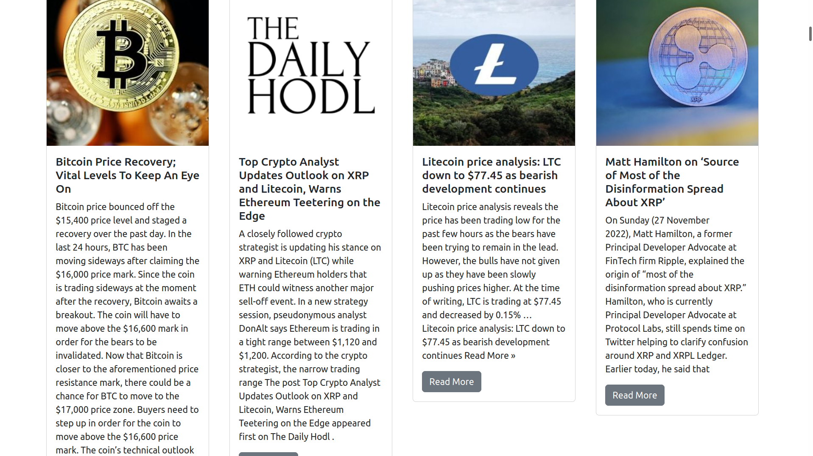

# website
dexratio website
Django app for the dexratio website


DEXratio News

Convenient place for staying up to date with multiple cryptocurrency and blockchain news publishers in one place.
```s
Name: 	Price: 	Market Cap: 	High Day: 	Low Day:
BTC 	$ 16,524.8 	$ 317.57 B 	$ 16,587.2 	$ 16,444.2
BSV 	$ 40.13 	$ 771.86 M 	$ 40.37 	$ 39.85
ETH 	$ 1,211.90 	$ 148.30 B 	$ 1,222.51 	$ 1,203.78
XRP 	$ 0.3994 	$ 39.94 B 	$ 0.4029 	$ 0.3953
BCH 	$ 112.70 	$ 2.17 B 	$ 113.46 	$ 112.21
XMR 	$ 137.17 	$ 2.50 B 	$ 138.88 	$ 136.25
ZEC 	$ 41.51 	$ 540.75 M 	$ 41.95 	$ 41.18
EOS 	$ 0.9340 	$ 1.06 B 	$ 0.9415 	$ 0.9289
LTC 	$ 77.78 	$ 5.58 B 	$ 78.19 	$ 76.06
XLM 	$ 0.09004 	$ 4.50 B 	$ 0.09070 	$ 0.08794
ADA 	$ 0.3172 	$ 10.72 B 	$ 0.3185 	$ 0.3127
USDT 	$ 0.9994 	$ 65.32 B 	$ 0.9995 	$ 0.9992
MIOTA 	$ 0.2163 	$ 601.13 M 	$ 0.2175 	$ 0.2138
TRX 	$ 0.05319 	$ 4.90 B 	$ 0.05348 	$ 0.05274
```

